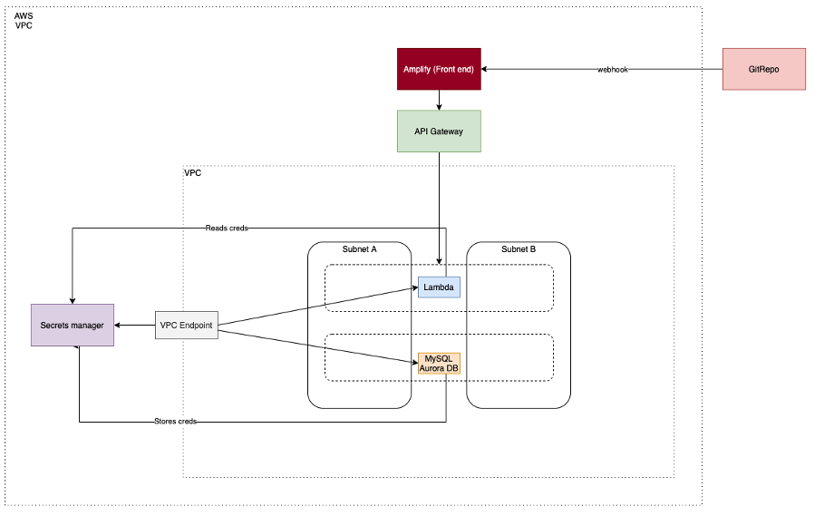
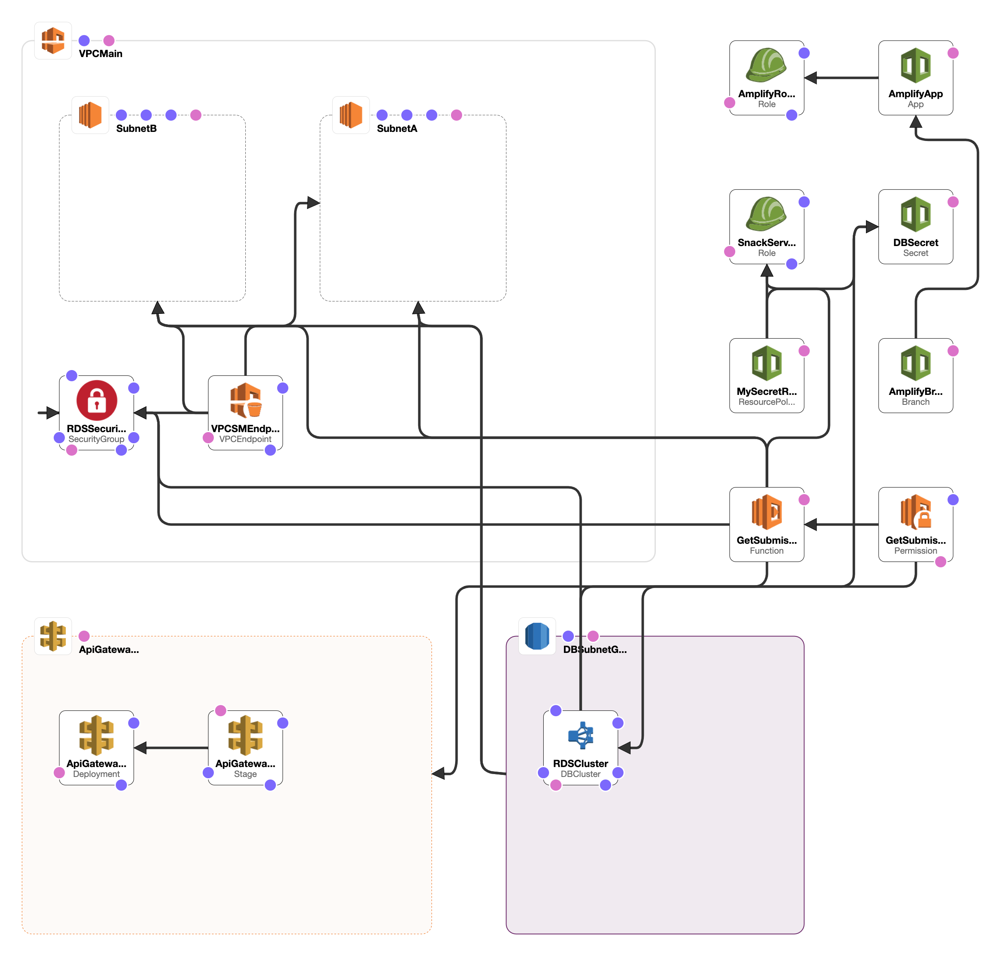

# Serverless Snack Poll Results

###1. Overview

This project contains the source code and supporting files for a 3-tier serverless application built in AWS and deployed using AWS's SAM (Serverless Application Model) cli.

###2. Set up

####I. INSTALL DEPENDENCIES
1. You will need an AWS account. If you need to set one up, see aws.amazon.com and choose **Create an AWS Account.**
2. The IAM user you use with SAM must have sufficient permission to make AWS service calls to and manage the services that will be listed down below. A sure-fire way to do this is by granting administrator privileges to your IAM user 
3. Install Docker
4. Install SAM cli. Go [here](https://docs.aws.amazon.com/serverless-application-model/latest/developerguide/serverless-sam-cli-install-linux.html) for step by step instructions.

####II. BUILD

To build, run the following:
```bash
sam build --use-container
```

####III. DEPLOY

To deploy, run the following command, and replace the OAuthToken placeholder with the provided Personal Access token generated on Github. (Request from this account if you do not have a token)
```bash
sam deploy --guided  --capabilities CAPABILITY_NAMED_IAM 
```

####IV. CONFIG
Enable CORs.
1. Go to API Gateway and navigate into the API created in this project. 
2. Click /get on the left hand column, and then method response. Add a http status of 200, then in that same row, add these headers:
- Access-Control-Allow-Headers	
- Access-Control-Allow-Methods	
- Access-Control-Allow-Origin	

3. Go back to the previous page and then navigate into Integration Request.
4. Untick Use Lambda Proxy integration. 
5. Enable Cors, then go back and tick Use Lambda Proxy integration.
6. Go to actions in the left column and click Deploy the API. Select the prod stage.

Trigger Amplify Build
1. Navigate to the Amplify AWS Service in your AWS console.
2. Click on tile of the app that was created as part of this project.
3. Click build. This will trigger Amplify to build and deploy the react web app.


###3. System Architecture
This project is a simple application, displaying a summary of a team’s Snack submissions and vote scores. The application consists of 3 main components:
1.	The snack submission and vote data are stored in a RDS Database
2.	The ‘logic layer’ which queries the database and formats the data is completed by AWS Lambdas, and 
3.	The formatted data is displayed using a React web framework deployed using AWS Amplify.

The services were designed as shown in Fig 1. Below (simple). For a more in-depth architecture diagram, see the next section.



###4. Design decisions
All the services that were selected are managed, serverless services for it’s inherent scalability, cost effectiveness, and support for CICD. The design behind the system architecture will be covered starting from the database tier to the presentation layer. 



####I. DB
The MySQL database utilizes the Aurora MySQL Cluster. This was selected for several reasons:
-	Scalability: The cluster scales up and down according to data usage by setting up a minimum and maximum ACU (Aurora Capacity Unit). In this case, it was set to 1-4 ACU’s.
-	Fault tolerant: Can enable multiple AZ’s, each containing a copy. Uses failover mechanism when primary instance is affected, promoting one of the replica instances.
-	Serverless: easy to set up. 
-	Users are billed per instance hour consumed.

####II. Logic
-	AWS Lambda, a serverless compute service, communicates with RDS directly, being in the same VPC & Subnets. Lambda charges are based on the number of requests, and the duration of the request processing.
-	This seamlessly integrates with Secrets Manager to retrieve MySQL AuroraDB credentials via a VPC endpoint. Secrets Manager was used as a secure key storage as it not only stores, but also randomly generates passwords, rotates and manages different types of secrets. As Secrets Manager lies outside the VPC lambda resides in, a VPC endpoint is used to directly connect the VPC with Secrets without leaving the AWS Network. VPC Endpoint is powered by AWS PrivateLink which uses private IP addresses and security groups within the Amazon VPC, removing the need to set up internet gateways, NAT gateways, route tables, firewalls, or whitelisting. VPC Endpoint charges by the hour consumed. Secret Manager charged $0.40 per secret per month, and an additional $0.05 for every 10,000 API calls.
-	The AWS Lambda functions are exposed to the internet via API Gateway. API gateway is used to publish and manage the RESTful API for this app, as well as handling traffic management, CORS support, throttling, monitoring, versioning and testing. This pricing model for this application begins at $0.90 per million requests at the highest tier and decreases as your API usage increases.

####III. Presentation
-	Amplify is used to quickly deploy a React app which display data retrieved from the RDS via API Gateway & Lambda. This is suitable for quickly deploying Single Page Apps in just a few minutes with a git-based workflow. This service will re-provision, build and deploy the associated [repo](https://github.com/jwu2020/serverless-react) when any updates to the repo are pushed through a webhook. Amplify has a lot more features that can be used such as set up storage, APIs, PR reviews, Authentication, so forth.  It costs $0.01 minutes for per build minute beyond the Free Tier (1000 build minutes/month free during your 12-month Free Tier term), so it is important long term to consider how to reduce build time, and the frequency of updates. 


###4. Future improvements
1. Consider setting up a DLQ for failed lambda executions & cloud watch metrics for failure alerts.
2. Consider using another lighter weight front end as Amplify has the capability to deploy full stack apps. Using a containerised front end service could be a viable alternative.
3. Utilise Lambda layers to reduce redundant code.
4. Enable cors in the cloud formation template.
5. Complete the vote submission feature in the React app.
